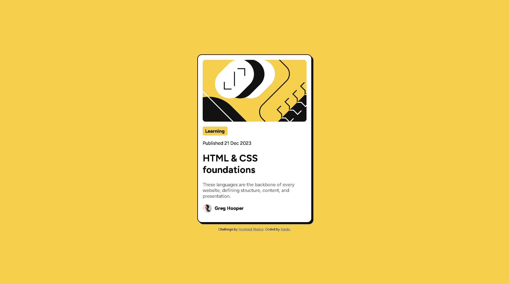

# Frontend Mentor - Blog preview card solution

This is a solution to the [Blog preview card challenge on Frontend Mentor](https://www.frontendmentor.io/challenges/blog-preview-card-ckPaj01IcS). Frontend Mentor challenges help you improve your coding skills by building realistic projects. 

## Table of contents

- [Overview](#overview)
  - [The challenge](Blog preview card)
  - [Screenshot](blocg-preview-card.jpg)
  - [Links](#links)
- [My process](#my-process)
  - [Built with](VS Code)
  - [What I learned](Html & Css)
  - [Continued development](learn how to use css )
  - [Useful resources](https://developer.mozilla.org/en-US/ , https://www.w3schools.com/)
  - [AI Collaboration](Claude Code)
- [Author](kendo)
- [Acknowledgments](Me and Claude)

**Note: Delete this note and update the table of contents based on what sections you keep.**

## Overview

### The challenge

Users should be able to:

- See hover and focus states for all interactive elements on the page

### Screenshot



**Note: Delete this note and the paragraphs above when you add your screenshot. If you prefer not to add a screenshot, feel free to remove this entire section.**

### Links

- Solution URL: [Add solution URL here](https://your-solution-url.com)
- Live Site URL: [Add live site URL here](https://your-live-site-url.com)

## My process

### Built with

-VS Code
-HTML 
-CSS

**Note: These are just examples. Delete this note and replace the list above with your own choices**

### What I learned

Use this section to recap over some of your major learnings while working through this project. Writing these out and providing code samples of areas you want to highlight is a great way to reinforce your own knowledge.

To see how you can add code snippets, see below:

```html
<!DOCTYPE html>
<html lang="en">
<head>
  <meta charset="UTF-8">
  <meta name="viewport" content="width=device-width, initial-scale=1.0"> <!-- displays site properly based on user's device -->

  <link rel="icon" type="image/png" sizes="32x32" href="./assets/images/favicon-32x32.png">
  
  <title>Frontend Mentor | Blog preview card</title>

  <!-- Feel free to remove these styles or customise in your own stylesheet 👍 -->
  <style>
    .attribution { font-size: 0.6875rem; text-align: center; }
    .attribution a { color: hsl(228, 45%, 44%); }
  </style>
  <link rel="preconnect" href="https://fonts.googleapis.com">
  <link rel="preconnect" href="https://fonts.gstatic.com" crossorigin>
  <link href="https://fonts.googleapis.com/css2?family=Figtree:ital,wght@0,300..900;1,300..900&display=swap" rel="stylesheet">
  <link rel="stylesheet" href="style.css">
</head>
<body>

    <div class="container">

      


      <p class="Learning">Learning</p>
 
      <p class="weight-5" >Published 21 Dec 2023</p>

      <h1>HTML & CSS foundations</h1>
 
      <p class="weight-5 grey">These languages are the backbone of every website, defining structure, content, and presentation.</p>

      <p class="weight-8" >Greg Hooper</p>

    </div>
  
  <footer class="attribution">
    Challenge by <a href="https://www.frontendmentor.io?ref=challenge">Frontend Mentor</a>. 
    Coded by <a href="#">Kendo</a>.
  </footer>
</body>
</html>
```
```CSS
body {
    background-color:hsl(47, 88%, 63%) ;
    font-size: 16px;
    font-family: "Figtree", sans-serif;
    display: flex;
    min-height: 100vh;
    flex-direction: column;
    justify-content: center;
    align-items: center;
    margin: 0;
}
.container {
    box-sizing: border-box;
    background-color: hsl(0, 0%, 100%);
    border-radius: 15px;
    border: 2px solid black;
    padding: 16px;
    width:90%;
    max-width: 384px;
    box-shadow: 5px 5px  hsl(0, 0%, 7%);
}
.logo {
    display: flex;
    justify-content: center;
    width: 100%;
    border-radius: 10px;
}
.Learning {
    display: inline-block;
    background-color: hsl(47, 88%, 63%);
    font-weight: 800;
    align-content: center;
    height: 30px;
    width: 75px;
    padding-left: 8px;
    margin-bottom: 0;
    border-radius: 5px;
}
h1:hover {
    color:hsl(47, 88%, 63%) ;
}
.weight-5 {
    font-weight: 500;
}
.grey {
    color: hsl(0, 0%, 42%);
}
.weight-8 {
    display: flex;
    align-items: center;
    font-weight: 800;
}
.weight-8 img{
    width: 30px;
    height: 30px;
    border-radius: 100%;
    padding-right: 10px;
}
footer {
    margin-top: 15px;
}
```

If you want more help with writing markdown, we'd recommend checking out [The Markdown Guide](https://www.markdownguide.org/) to learn more.

**Note: Delete this note and the content within this section and replace with your own learnings.**

### Continued development

Use this section to outline areas that you want to continue focusing on in future projects. These could be concepts you're still not completely comfortable with or techniques you found useful that you want to refine and perfect.

**Note: Delete this note and the content within this section and replace with your own plans for continued development.**

### Useful resources

- [Example resource 1](https://developer.mozilla.org/en-US/) - This help me about html and css
- [Example resource 2](https://www.w3schools.com/) -This is another website that help me with html and css

**Note: Delete this note and replace the list above with resources that helped you during the challenge. These could come in handy for anyone viewing your solution or for yourself when you look back on this project in the future.**

### AI Collaboration

Describe how you used AI tools (if any) during this project. This helps demonstrate your ability to work effectively with AI assistants.

-i use ai to hint and guide me
-if i not know answer for too long to use a to answer me

**Note: Delete this note and the content above if you didn't use AI, or replace with your own experience.**

## Author

**Note: Delete this note and add/remove/edit lines above based on what links you'd like to share.**

## Acknowledgments

Thank you Claude code help me work.

**Note: Delete this note and edit this section's content as necessary. If you completed this challenge by yourself, feel free to delete this section entirely.**
